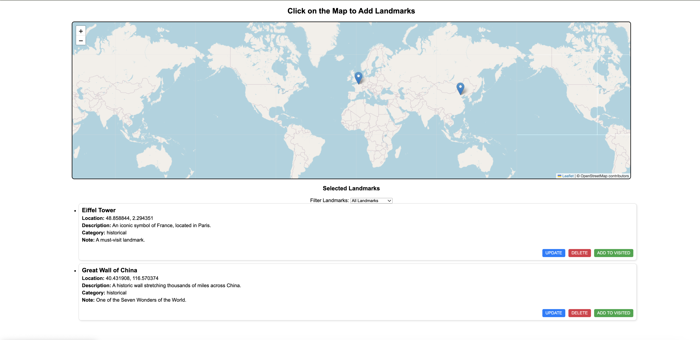

# ceng-3502-landmarks-app



## Project Description

The Landmarks App allows users to:

- **Add new landmarks** with detailed information
- **Mark landmarks as visited** with a visitor name and date
- **View all landmarks** and **view visit history**

The project supports full **CRUD operations** for managing landmarks and visited landmark data.

## Technologies Used

- **Backend**: Node.js, Express.js
- **Database**: Local JSON storage
- **Frontend**: HTML, CSS, JavaScript (Fetch API)

---

## Features

- Add, retrieve, update, and delete landmarks
- Mark landmarks as visited
- View the list of all landmarks
- View the list of visited landmarks
- Updating visit status
- Viewing visit details per landmark

## Project Structure

The project is organized as follows:

```
ceng-3502-landmarks-app/
│
├── api/                   # Backend code (Express server)
│   ├── controllers/        # Business logic for landmarks & visits
│   ├── data/               # JSON files for storing data
│   ├── routes/             # API route definitions
│   ├── server.js           # Main server file
│   ├── package.json        # Backend dependencies and scripts
│
├── public/                 # Frontend files
│   ├── index.html          # Frontend UI
│   ├── style.css           # Basic styling
│   ├── main.js             # Fetch API interactions
│
└── README.md               # Project documentation
```

---

## Installation

To install and set up the project, follow these steps:

1. Clone the repository:

```bash
git clone https://github.com/aysuakbaba/ceng-3502-landmarks-app.git
```

2. Navigate to the project directory::

```bash
cd ceng-3502-landmarks-app
```

3. Install the dependencies:

```bash
npm install
```

4. Start the development server:

```bash
npm start
```

5. Access the front-end

```bash
Open public/index.html in your browser.
```
